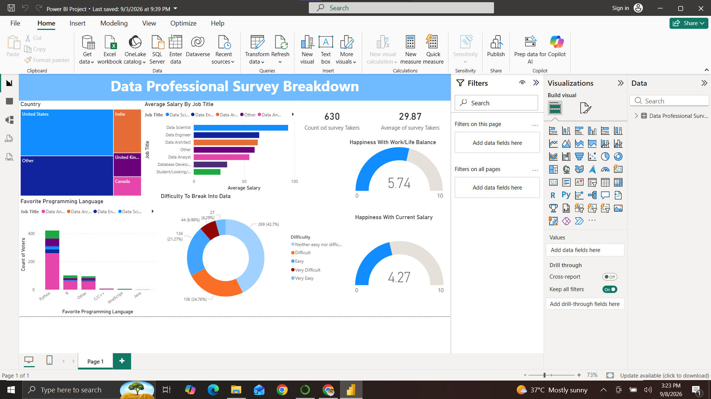

# Data Professional Survey Analysis Dashboard

## Project Overview

An interactive Power BI dashboard created to analyze survey data from data professionals.

The dashboard explores salary, job roles, programming languages, countries, and job satisfaction among data professionals.

## Objectives

- Analyze salary differences across job roles
- Explore the most popular programming languages
- Compare data professionals across countries
- Analyze work-life balance satisfaction
- Analyze satisfaction with current salary
- Understand the perceived difficulty of entering the data industry

## Tools

- Power BI
- Power Query
- Data Visualization
- Data Analysis

## Dashboard Features

- KPI cards
- Salary analysis
- Job title comparison
- Country analysis
- Programming language analysis
- Work-life balance analysis
- Salary satisfaction analysis
- Interactive visualizations

## Dashboard Preview

## Key Insights

- ...
- ...
- ...